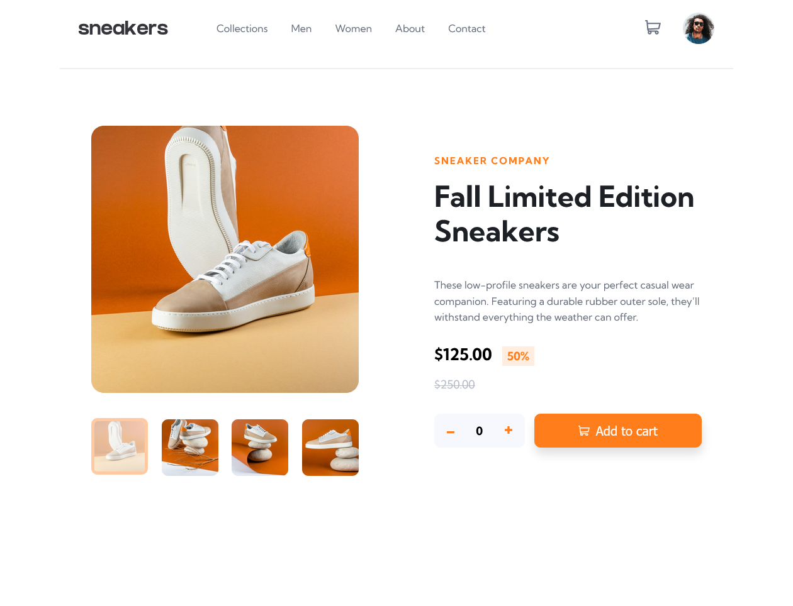

## Table of contents

- [Overview](#overview)

  - [The challenge](#the-challenge)
  - [Screenshot](#screenshot)
  - [Links](#links)
  - [Built with](#built-with)
  - [What I learned](#what-i-learned)
  - [Continued development](#continued-development)
  - [Useful resources](#useful-resources)

- [Author](#author)

## Overview

- This is an e-commerce product page. user can add to cart shoe based on their choice clicking on the add to cart button after selecting desire number of shoe

### The challenge

Users should be able to:

- View the optimal layout for the site depending on their device's screen size
- See hover states for all interactive elements on the page
- Open a lightbox gallery by clicking on the large product image
- Switch the large product image by clicking on the small thumbnail images
- Add items to the cart
- View the cart and remove items from it

### Screenshot



### Links

- Solution URL: [solution here](https://github.com/nasim67reja/Ecommerce.github.io)
- Live Site URL: [ live site here](https://nasim67reja.github.io/Ecommerce.github.io/)

### Built with

- Semantic HTML5 markup
- CSS custom properties
- Flexbox
- CSS Grid
- JavaScript
- Desktop-first workflow

### What I learned

I have learned a lot of cool technique by building this project such don't use **display:none** property beacuse **display:none** doesn't support transition property.

I have learned event delegation and by the help of this I was able to done the tab component . I also learn how to create a slider.

I have learned how to use box shadow instead of border-bottom

```css
.main-nav-link:hover,
.main-nav-link:active {
  /* trick */
  box-shadow: 0px 6.1rem 0 -8px var(--main-color);
}
```

```js
tabBox.addEventListener("click", function (e) {
  const clicked = e.target.closest(".product-image-small");
  if (!clicked) return;

  //   remove active class
  tabImage.forEach((el) => el.classList.remove("active-small"));
  contentImage.forEach((el) => el.classList.remove("active"));

  //add active class
  clicked.classList.add("active-small");
  document
    .querySelector(`.operation-content-${clicked.dataset.tab}`)
    .classList.add("active");
});
// sticky Navigation
const section1 = document.querySelector("#section1");
const mainHeader = document.querySelector(".header");

const initialCoords = section1.getBoundingClientRect();

window.addEventListener("scroll", function () {
  if (window.scrollY > initialCoords.top) {
    mainHeader.classList.add("sticky");
  } else mainHeader.classList.remove("sticky");
});
```

### Continued development

I want to continue building project but these time i want to focus on javascript more than html and css.

### Useful resources

- [Example resource 1](https://github.com/jonasschmedtmann/complete-javascript-course/blob/master/13-Advanced-DOM-Bankist/final/script.js) - This helped me for understand the event delegation and the tab component and slider.

## Author

- Website - [Nasim Reja](https://www.your-site.com)
- Frontend Mentor - [@nasim67reja](https://www.frontendmentor.io/profile/@nasim67reja)
- Twitter - [@Nasimreja97](https://www.twitter.com/@Nasimreja97)
